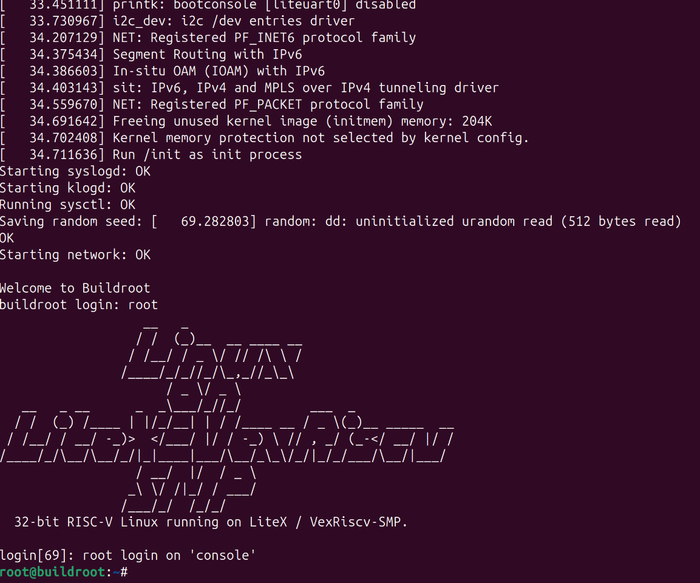

## 其他语言

* [English Version](README.md)

# patch_litex_linux_for_alinx7020
### 介绍
本项目是针对 Alinx 7020 开发板的 Linux 系统移植，基于 litex 项目。

### 注意
由于litex、litex-boards、linux-on-litex-vexriscv 相关部分都已合入主线，一下的补丁部分只使用于上述3个项目的老版本。

### 操作说明（当前程序在Linux下测试运行）

**安装**

1. **使用补丁最简单的方法是从** https://github.com/itisme/litex 克隆 `litex` 项目，然后进行安装：
    - 安装 `litex`：
      ```bash
      git clone https://github.com/itisme/litex
      cd litex
      python ./litex_setup.py --init --install --user (--user 安装到用户目录) --config=(minimal, standard, full)
      ```
    - 编译基于 `alinx_ax7020` 开发板的 Linux 测试项目，编译依赖 Vivado 环境：
      ```bash
      git clone https://github.com/itisme/linux-on-litex-vexriscv
      source <Xilinx Vivado dir>/settings64.sh
      python ./make.py --board ax7020 --uart-baudrate 1e6 --build
      ```

2. **先从 `litex` 原始地址克隆，然后运行该项目的补丁程序，再编译测试程序：**
    - 安装 `litex`：
      ```bash
      git clone https://github.com/enjoy-digital/litex
      cd litex
      python ./litex_setup.py --init --install --user (--user 安装到用户目录) --config=(minimal, standard, full)
      ```
    - 运行补丁：
      ```bash
      git clone https://github.com/itisme/patch_litex_linux_for_alinx7020
      cd patch_litex_linux_for_alinx7020
      python ./patch_litex.py
      python ./patch_litex-boards.py
      ```
    - 编译基于 `alinx_ax7020` 开发板的 Linux 测试项目，编译依赖 Vivado 环境：
      ```bash
      git clone https://github.com/itisme/linux-on-litex-vexriscv
      source <Xilinx Vivado dir>/settings64.sh
      python ./make.py --board ax7020 --uart-baudrate 1e6 --build
      ```

**运行Linux镜像**

1. **硬件连线：**
   - **FPGA串口连接：**
     参考 Alinx 7020 用户手册，连接串口线。芯片引脚 W19 是 PL 的输出引脚，连接 USB 转串口的输入；W18 是 PL 的输入引脚，连接 USB 转串口的输出。
   - **连接好 JTAG 线。**

2. **下载系统镜像：**
   - 下载 [镜像文件](https://github.com/litex-hub/linux-on-litex-vexriscv/issues/164)，解压到指定目录，例如 `images/`。

3. **打开 Terminal 1**，运行终端程序，作为系统控制台。运行前确认 FPGA 串口，在本示例中连接 `/dev/ttyUSB1`，串口比特率默认为 1M：
   ```bash
   litex_term --images=images/boot.json --speed=1e6 /dev/ttyUSB1
   ```

4. **打开 Terminal 2**，加载编译生成的 `ps7_init.tcl` 文件，该文件位于 `<linux-on-litex-vexriscv>/build/ax7020/gateware/ax7020.gen/sources_1/ip/Zynq/ps7_init.tcl`：
   - 启动 xsdb：
     ```bash
     source <Xilinx Vivado dir>/settings64.sh
     hw_server &
     xsdb
     ```
   - 在 xsdb 环境中运行命令：
     ```tcl
     source <linux-on-litex-vexriscv>/build/ax7020/gateware/ax7020.gen/sources_1/ip/Zynq/ps7_init.tcl
     ps7_init
     ps7_post_config
     ```
   - 然后加载 bit 文件：
     ```tcl
     fpga -file <linux-on-litex-vexriscv>/build/ax7020/gateware/ax7020.bit
     ```

正常情况下，即可看到下列输出：

